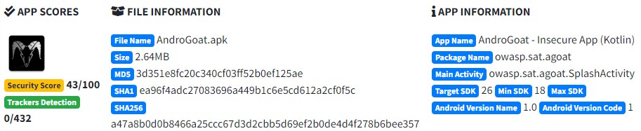
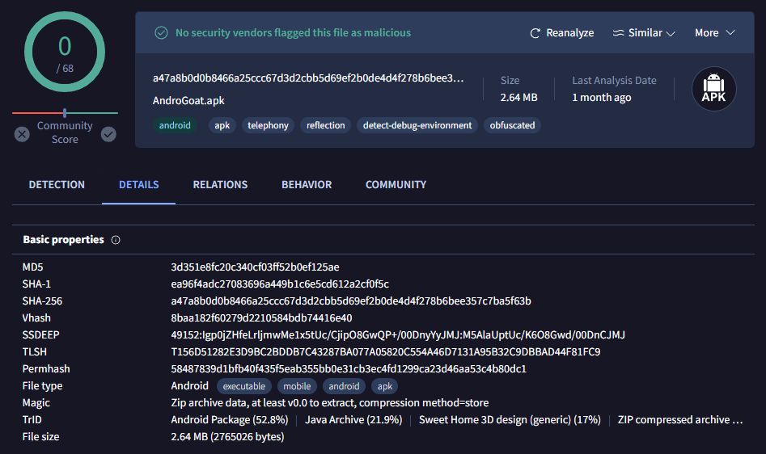
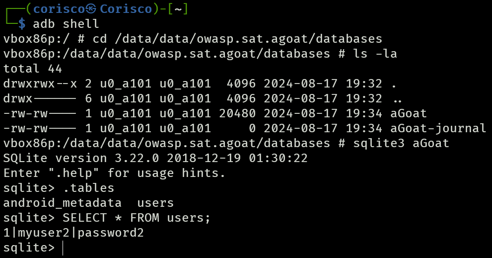

# AndroGoat Report

AndroGoat is a purposely vulnerable Android application created for educational purposes. It is designed to help security researchers and developers understand and practice exploiting common Android security vulnerabilities.

[AndroGoat GitHub](https://github.com/satishpatnayak/AndroGoat)


## MobSF Analysis

[MobSF PDF Report ](pdf/androgoat.pdf)



### File Hash Identification

SHA256
```bash
    a47a8b0d0b8466a25ccc67d3d2cbb5d69ef2b0de4d4f278b6bee357c7ba5f63b
```

## VirusTotal Reputation

The APK is identified as an Android executable, with no security vendors flagging it as malicious. Given its purpose as a vulnerable educational app, its clean reputation on VirusTotal aligns with its expected nature.

[VirusTotal Reference](https://www.virustotal.com/gui/file/a47a8b0d0b8466a25ccc67d3d2cbb5d69ef2b0de4d4f278b6bee357c7ba5f63b)



## Database Access

The **SQLite** database in the AndroGoat app was accessed without encountering any password or encryption mechanisms. This was achieved using **ADB** and SQLite commands within an emulated environment using **Genymotion Desktop**.

The users table was queried, revealing the stored credentials:



## Tools
- **[Mobile Security Framework (MobSF)](https://github.com/MobSF/Mobile-Security-Framework-MobSF)**
- **[VirusTotal](https://www.virustotal.com/)**
- **[Genymotion Desktop](https://docs.genymotion.com/desktop/)**
- **[ADB (Android Debug Bridge)](https://developer.android.com/studio/command-line/adb)**
- **[Kali Linux](https://www.kali.org/)**
- **[Docker](https://www.docker.com/)**
- **[VSCode](https://code.visualstudio.com/)**

## Author
Report by: Pedro Coelho  
CESAR School  
Specialization in Cybersecurity  
Mobile Application Security Course  
Instructor: Erick Nascimento