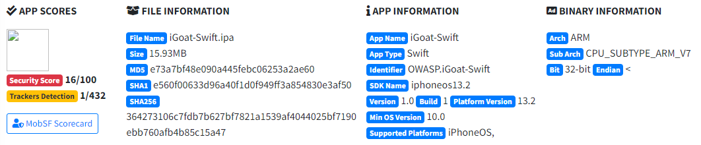
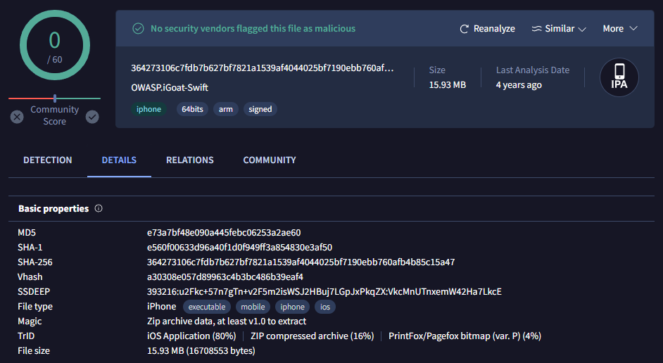
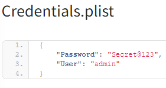

# iGoat-Swift Report

iGoat-Swift is an intentionally vulnerable iOS application created for educational purposes. It is designed to assist security researchers and developers in understanding and practicing exploitation techniques for common iOS security vulnerabilities.

[iGoat-Swift GitHub](https://github.com/OWASP/iGoat-Swift)

## Table of Contents
- [iGoat-Swift Report](#igoat-swift-report)
  - [Table of Contents](#table-of-contents)
  - [MobSF Analysis](#mobsf-analysis)
  - [VirusTotal Reputation](#virustotal-reputation)
  - [Insights](#insights)
    - [Insecure Network Configuration](#insecure-network-configuration)
    - [Binary Code Vulnerabilites](#binary-code-vulnerabilites)
    - [Dynamic Library \& Framework Vulnerabilities](#dynamic-library--framework-vulnerabilities)
    - [Endpoints](#endpoints)
    - [Emails](#emails)
    - [Libraries](#libraries)
    - [Files](#files)
    - [Strings](#strings)
  - [Tools](#tools)
  - [Author](#author)

  
## MobSF Analysis

[iGoat-Swift PDF Report ](pdf/igoat.pdf)




**File Hash Identification**

SHA256
```bash
    364273106c7fdb7b627bf7821a1539af4044025bf7190ebb760afb4b85c15a47
```

## VirusTotal Reputation

The iOS IPA is identified as a vulnerable educational app, with no security vendors flagging it as malicious. Its clean status on VirusTotal is consistent with its purpose for security training and research.

[VirusTotal Reference](https://www.virustotal.com/gui/file/364273106c7fdb7b627bf7821a1539af4044025bf7190ebb760afb4b85c15a47)



## Insights

### Insecure Network Configuration
The app disables App Transport Security (ATS), allowing insecure HTTP connections. This configuration leaves network traffic vulnerable to interception and man-in-the-middle attacks.
Attention Points:

- Test for sensitive data exposure via unsecured HTTP.
- Investigate for potential TLS downgrade attacks.
---

### Binary Code Vulnerabilites
The binary presents several potential vulnerabilities that may be exploited:


**1. Use of WebView Component**
 The WebView component may be vulnerable to cross-site scripting (XSS) or code injection if not securely implemented.
- Cross-site scripting (XSS), code injection, remote code execution via WebView.

**2. Logging Sensitive Information**
The use of _NSLog for logging could lead to sensitive data leakage. Attackers may harvest sensitive information from logs to escalate their attacks.
- Log analysis for sensitive data exposure, lateral movement through leaked credentials.

**3. Use of Insecure APIs** and **Uncontrolled Memory Allocation**
 Vulnerable functions such as _fopen, _memcpy, _strcpy, and _strlen may allow for buffer overflow and memory corruption attacks. The app's use of _malloc instead of safer alternatives could expose the app to memory allocation exploits such as heap overflow.
- Buffer overflow exploitation, memory corruption, unauthorized code execution.
- Heap overflow exploitation, memory leak attacks.
  
---

### Dynamic Library & Framework Vulnerabilities
The dynamic libraries  exhibit several vulnerabilities, including:

**1. Lack of Stack Canary Protection**
- Absence of stack canaries in some libraries increases the risk of buffer overflow attacks.
  
**2. No Automatic Reference Counting (ARC)**
- Some binaries do not use ARC, leaving them vulnerable to memory corruption exploits.
  
**3. Misconfigured Runpath Search Path (@rpath)**
- The presence of @rpath in certain binaries could be leveraged for privilege escalation.


**4. Unencrypted Binaries**
- Lack of encryption across several binaries makes them susceptible to reverse engineering and potential attacks.


**Attention Points**
- Buffer overflow exploitation, privilege escalation via @rpath, reverse engineering threats, memory corruption, unauthorized code execution.
---
### Endpoints

These endpoints suggest potential risks if exposed:

```
http://localhost:8080/igoat/token?username=
http://localhost:8080/igoat/user
http://localhost:8081/cryptokey.php
http://localhost:8081/webkit.php
http://localhost:8081/checkout/checkout.php
```

- **Sensitive Data Exposure**: Localhost endpoints could inadvertently expose sensitive information like tokens, user data, or payment details.
- **Injection Attacks**: PHP endpoints (cryptokey.php, webkit.php) are prone to SQL injection or remote code execution if not properly sanitized.
- **Weak Access Control**: User-related endpoints may allow unauthorized access if not properly authenticated.
  
---
### Emails
The following email addresses were identified during the recon phase:

```
johndoe@yap.com 
john@test.com
```
Other emails are visible within the app and could lead to identifying external services or accounts, which may provide attack vectors for further investigation during future phases. Placeholder emails suggest test data or dummy inputs, possibly used for validation purposes, and can lead to potential information where sensitive email handling could be explored.

---

### Libraries
```
/usr/lib/libsqlite3.dylib
```
SQLite is often used for local storage in iOS apps. If not properly encrypted or secured, it could expose sensitive user data. Look how the app is handling data stored in SQLite.

---

### Files

**Sensitive Configuration Files**

```
iGoat-Swift.app/Credentials.plist
iGoat-Swift.app/embedded.mobileprovision 
iGoat-Swift.app/Assets.plist
```
These and other files may expose sensitive credentials and information related to provisioning profiles.

`iGoat-Swift.app/Credentials.plist`




---

### Strings

The strings analysis revealed several potential insights for further investigation, particularly related to database queries and sensitive information handling.

```
INSERT INTO creds(username, password) VALUES(?, ?)
SELECT "ownerCount" FROM "%@" WHERE "hash" = ?;
SELECT view_id FROM views WHERE name=?
SELECT filename, key, type, length, revpos, encoding, encoded_length FROM attachments WHERE sequence=?
SELECT key, value FROM info
```

These examples and other SQL queries strings suggest possible areas where sensitive data such as usernames and passwords are being handled. This could indicate potential vulnerabilities like **SQL injection** or **improper credential storage**, which warrant deeper exploration.

There are numerous other strings that may reveal additional attack vectors: `password, user, token, admin, key` These and other relevant strings provide opportunities for further investigation in the next phases of analysis.

## Tools
- **[Mobile Security Framework (MobSF)](https://github.com/MobSF/Mobile-Security-Framework-MobSF)**
- **[VirusTotal](https://www.virustotal.com/)**
- **[Docker](https://www.docker.com/)**
- **[VSCode](https://code.visualstudio.com/)**

## Author
Pedro Coelho  
CESAR School  
Specialization in Cybersecurity  
Mobile Application Security Course  
Instructor: Erick Nascimento